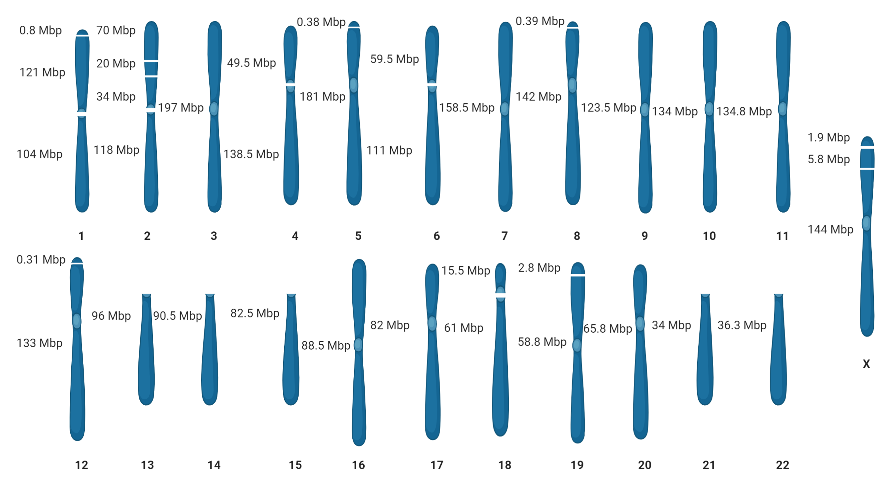

# Gap-Free Long-read Assembler (GALA) 
**GALA** is a **Ga**p-free **L**ong-read **A**ssembler. GALA builds a multi-layer graph from different preliminary assemblies, long-reads, and potentially other sources of information, such as Hi-C assemblies. During this process, it identifies mis-assembled contigs and trim them. The corrected data are then partitioned into multiple scaffolding groups, each representing a single chromosome. Each scaffolding group is assembled independently with existing assembly tools and a simplified version of overlap-graph-based merging algorithm is used to merge multiple contigs if necessary.


**GALA** has [three modules](#Description)  each can be used separately.
	<p align="center">

	</p>

## GALA performance with a human genome
GALA assembled a human genome using (HiFi) reads. GALA used canu draft for CHM13 and the current human reference genome GRCh38.p13 as input of GALA. In this way GALA essentially created a reference-guided de novo assembly. GALA assembly comprised of 37 continuous contigs, including 8 telomer-to-telomer gap-free pseudomolecular sequences, 4 near complete chromosomes each with a small telomeric fragment unanchored, 3 with only gapped centromeric regions, and the long arm of acrocentric chromosomes. [Human Genome](https://doi.org/10.5281/zenodo.4045985)
	<p align="center">

	</p>

## Dependency
1. [Minimap2](https://github.com/lh3/minimap2)
2. [bwa](https://github.com/lh3/bwa)
3. [samtools](https://github.com/samtools/samtools)
4. [python2.7](https://www.python.org/download/releases/2.7/)
5. [canu](https://github.com/marbl/canu)

## Installation
GALA can be run directly from the gala folder
>git clone [https://github.com/ganlab/gala.git](https://github.com/ganlab/gala.git)
>cd GALA

**Or**
You can run `install` to add it to your **PATH**	

## Usage
Using GALA pipeline to assemble a genome involves preliminary steps and three main Steps.
### Preliminary step and Inputs    
#### Preliminary step
Use different software to construct preliminary assemblies from long reads, e.g. ([Canu](https://github.com/marbl/canu), [Flye](https://github.com/fenderglass/Flye), [MECAT](https://github.com/xiaochuanle/MECAT), [Miniasm](https://github.com/lh3/miniasm), and [Wtdbg2](https://github.com/ruanjue/wtdbg2)).

#### Inputs:
* Raw reads and corrected reads if available.
* The user needs to prepare `draft_names_paths.txt` for preliminary assemblies.
**Here is an example:**
```
draft_01=path/to/draft_fasta_file
draft_02=path/to/draft_fasta_file
draft_03=path/to/draft_fasta_file
draft_n=path/to/draftfasta file
```
## GALA Single Command Mode
To run GALA using one command user can use the following command:
> gala  `draft_names_paths.txt` `fa/fq` `reads_file` `platform`

In single command mode, GALA used [canu](https://github.com/marbl/canu) for Chromosome-by-Chromosome assembly.
 
To use another assembler or multiple assemblers, GALA provides three choices  [Canu](https://github.com/marbl/canu), [Flye](https://github.com/fenderglass/Flye), and [Miniasm](https://github.com/lh3/miniasm), pass it to `-a` argument with a single space between them.

For sequencing_platform the user needs to provide it in this way: 
`-pacbio-raw` `-pacbio-corrected` `-nanopore-raw` `-nanopore-corrected` 
```
usage: gala -h  [options] <draft_names & paths> <fa/fq> <reads> <platform>

GALA Gap-free Long-read Assembler

positional arguments:
  draft_names           Draft names and paths [required]
  input_file            input type (fq/fa) [required]
  reads                 raw/corrected reads [required]
  sequencing_platform   -pacbio-raw -pacbio-corrected -nanopore-raw -nanopore-
                        corrected [required]

optional arguments:
  -h, --help            show this help message and exit
  -a [ASSEMBLER [ASSEMBLER ...]]
                        Chr-by_Chr assembler (canu flye miniasm) [default
                        canu]
  -b Alignment block length	 [default 5000]
  -p Alignment identity percentage	 [default 70%]
  -c Shortest contig length	 [default 5000]
  -q Mapping quality	 [default 20]
  -f Output files name	[default gathering]
  -o output files path	[default current directory]
  -v, --version         show program's version number and exit


  JohnUrbanFork-specific options
  --threads THREADS     Number of threads to use with Minimap2 and BWA.
  --fastmode            Use Minimap2 for read-mapping steps instead of BWA.
  --hifi                Use this flag if long read data is >99 pct accuracy on average. Default : assumes false. Affects some paramter choices. Typically for PacBioHiFi, but perhaps can work with
                        Nanopore Q20/Q30 chemistry (avg accuracy >99 pct).
  --sac                 Use this flag if nanopore data is >90-95 pct accuracy on average (e.g. super accurate basecalling mode, SAC). Default : assumes false. Affects some paramter choices. See:
                        https://github.com/marbl/canu/issues/2121
  --forcetrim           Optional use with --sac option to force end trimming of reads in Canu pipeline. See: https://github.com/marbl/canu/issues/2121
  --tellcanu TELLCANU   Put additional parameters to feed Canu in quotes.
  --tellflye TELLFLYE   Put additional parameters to feed Flye in quotes.
  --tellminiasm TELLMINIASM
                        Put additional parameters to feed Miniasm in quotes.
  --debug

```
## GALA Step-by-Step Mode (recommended)
### Mis Assembly Detector Module (MDM)
1.  Use the `comp` module to generate a `draft_comparison` file 
	> comp `draft_names_paths.txt`
3. Run  `draft_comparison` file to produce drafts comparison paf files
	> sh `draft_compare.sh`
4. Use the `mdm` module to identify mis-assembled contigs.
	> mdm `comparison_folder` `number of assembly drafts`
5.  Use the `newgenome` module to Produce `misassembly-free` drafts.
	>  newgenome `draft_names_paths.txt`	`cut_folder`
### Contig Clustering Module (CCM)
5.  Use the `comp` module to generate a `draft_comparison` file for `misassembly-free` drafts.
	> comp `new_draft_names_paths.txt` 
7. Run  `draft_comparison` file to produce new drafts comparison paf files.
	> sh `draft_compare.sh`
8. Run the `ccm` module to produce contigs `scaffolding groups`.
	> ccm `comparison_folder`  `number of assembly drafts`
	- **Note:**
		You can also use the `reformat` module to generate reformatted paf files and use them to confirm `Scaffolding groups`.
### Scaffolding Group Assembly Module (SGAM)
8. Map all drafts against raw long reads and self-corrected reads if available.
	 > bwa index   `misassembly-free draft`
	 bwa mem -x pacbio/ont2d `misassembly-free draft`	`long-reads` 
10. Use the following commands to separate the read names mapped to each contig
	> samtools view -H bam_file |grep "SQ"|cut -f 2|cut -d : -f 2 > contig_names
	
	> seprator `contig_names` `mapping.bam`
	
	> sh bam_seprator.sh
	
	> for i in bams/*; do samtools view $i | cut -f 1 > $i.read_names;done;
11. Use the `cat` command to concatenate read name files belongs to the same `scaffolding group`.
	* For example:
		> cat contig_1.bam.read_names contig_3.bam.read_names contig_7.bam.read_names > scaffold_1.read_names
12. Use the `readsep` Module to separate each scaffold correlated-reads.
	>for *i* in `scaffold_*.read_names`; do  readsep `raw/correted-reads`  `$i` -f `input reads file type fa/fq`
13. Implement **Chromosome-by-Chromosome** assembly approach to retrieve the gap-free chromosome-scale assembly by
	```
	Assemble each read set from scaffold_*.read.fq with different
	assembly software, e.g.(Canu, Flye, Mecat, Miniasm, and Wtdbg).
	```
	**we recommend** the user to try different  assembly tools especially ( [Flye](https://github.com/fenderglass/Flye), [MECAT](https://github.com/xiaochuanle/MECAT)/[NECAT](https://github.com/xiaochuanle/NECAT), and [Miniasm](https://github.com/lh3/miniasm))
14. Finally, map the **SGAM**  outcomes against one of the preliminary draft assemblies to confirm that all the contigs in the `scaffolding group` are assembled to the right chromosome/Scaffold. 
 
## Description
### **comp:**
The comp module used to generate a genome comparison file if the user wants to compare multiple genomes against each other.
```
usage: comp -h  [options] <draft_names & paths> 

Generate genome comparison files, part of GALA Gap-free Long-read Assembler

positional arguments:
  drafts                Draft names and paths [required]

optional arguments:
  -h, --help            show this help message and exit
  -o output files path	[default current directory]
  -v, --version         show program's version number and exit

```
### **mdm:**
Miss-assembly Detector Module used to detect misassembled contigs. The algorithm relies on the alignment's contradictory information. 

mis-assembly detection module should be applicable for error correction regardless of the specific algorithm used for assembly and can differentiate between misassembly and Structure variation
```
usage: mdm -h  [options] path/to/mapping_files number of drafts
MDM Mis-assembly Detector Module, part of GALA Gap-free Long-read Assembler

positional arguments:
  mapping_files         mapping paf file [required]
  drafts                Number of drafts [required]

optional arguments:
  -h, --help            show this help message and exit
  -b Alignment block length	 [default 5000]
  -p Alignment identity percentage	 [default 70%]
  -c Shortest contig length	 [default 5000]
  -q Mapping quality	 [default 20]
  -f Output files name	[default gathering]
  -o output files path	[default current directory]
  -v, --version         show program's version number and exit
```
#### **newgenome:**
The newgenome module trims the misassembled contigs and gives misassembly free genome. This module used only with multiple samples
```
usage: newgenome -h  [options] <draft_names & paths> <path to cut files>

Produce mis-assembly free genomes, part of GALA Gap-free Long-read Assembler 

positional arguments:
  draft                 Draft names and paths [required]
  cut_files             path_to_cut_files" [required]

optional arguments:
  -h, --help            show this help message and exit
  -f Output files name	[default new_genome]
  -o output files path	[default current directory]
  -v, --version         show program's version number and exit
```
### **ccm:**
Contig Clustering Module used to identify the `scaffolding groups` and the contigs overlap information in multiple  preliminary assemblies. 

ccm could have extended applications in generating consensus assembly from multiple sequences. Besides, it is useful in reference guide scaffolding to determine Chromosomes `scaffolding groups`
  ```
  usage: ccm -h  [options] <path/to/mapping_files> <number of drafts>

CCM Contig Clustering Module, part of GALA Gap-free Long-read Assembler

positional arguments:
  mapping_files         mapping paf file [required]
  drafts                Number of drafts [required]

optional arguments:
  -h, --help            show this help message and exit
  -b Alignment block length	 [default 5000]
  -p Alignment identity percentage	 [default 70%]
  -c Shortest contig length	 [default 5000]
  -q Mapping quality	 [default 20]
  -f Output files name	[default scaffolds]
  -o output files path	[default current directory]
  -v, --version         show program's version number and exit
  ```
### reformat
the reformat module filters the alignment data in paf mapping files and merge overlapping and continuous alignment intervals into a single mapping interval. So, each contig in query draft will have one alignment interval with the subject draft.
```
usage: reformat -h  [options] <path/to/mapping_files> <number of drafts>

Re-formatting mapping files module, part of GALA Gap-free Long-read Assembler

positional arguments:
  mapping_files         mapping paf file [required]
  drafts                Number of drafts [required]

optional arguments:
  -h, --help            show this help message and exit
  -b Alignment block length	 [default 5000]
  -p Alignment identity percentage	 [default 70%]
  -c Shortest contig length	 [default 5000]
  -q Mapping quality	 [default 20]
  -f Output files name	[default reformated]
  -o output files path	[default current directory]
  -v, --version         show program's version number and exit
  ```
### seprator
The seprator module used to separate contigs alignments in individual bams and separate the read names mapped to each contig in an individual file
```
usage: seprator -h  [options] <contig_names> <bam_file>

Separate each contig correlated read names, part of GALA Gap-free Long-read Assembler

positional arguments:
  contig_names          contig_names [required]
  bam_file              mapping bam file [required]

optional arguments:
  -h, --help            show this help message and exit
  -o output files path	[default current directory]
  -f Output files name	[default bam_seprator]
  -b output folder name	 [default bams]
  -v, --version         show program's version number and exit

Use the following command to produce contig_names file:
	samtools view -H <bam_file> |grep 'SQ'|cut -f 2|cut -d : -f 2 > contig_names
```
### readsep
The readsep module separates a set of reads from a sequencing dataset according to the read name in the definition line.
```
usage: readsep -h [options] <reads> <read_titles>

Extract reads from fasta or fastq, part of GALA Gap-free Long-read Assembler

positional arguments:
  reads                 raw/corrected reads [required]
  read_titles           read names [required]

optional arguments:
  -h, --help            show this help message and exit
  -f input file format (fa/fq)
  -v, --version         show program's version number and exit
  ```
## Licence
GALA is distributed under MIT license. See the [LICENSE file](https://github.com/ganlab/GALA/blob/master/LICENSE) for details.


