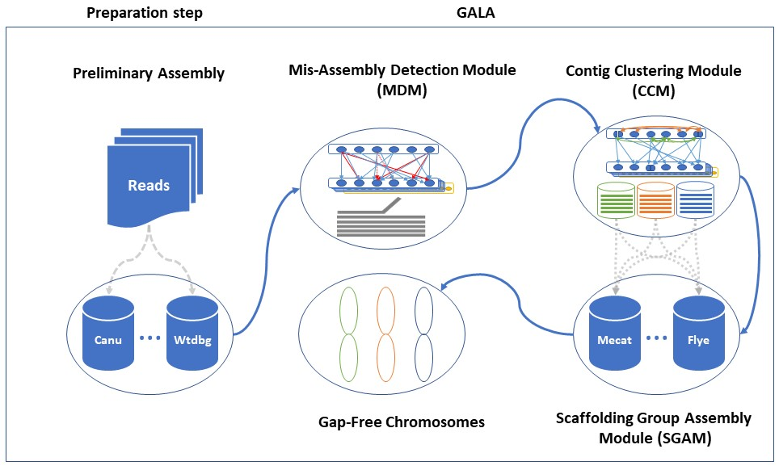

# Gap-Free Chromosome-scale Assembly (GALA) 
**GALA**, is a Gap-free chromosome-scALe Assembler. GALA builds a multi-layer graph from different preliminary assemblies, long-reads and potential other sources of information, such as Hi-C assemblies. GALA firstly, identify the mis-assembled contigs and trim it. Then, identify multiple linkage groups in the genome, each representing a single chromosome, and describing chromosome structure with raw reads and assembled contigs from multiple de novo assembly tools. Finally assemble each linkage group by integrating results from multiple assembly tools and inferring from the raw reads. 

**GALA** had [seven modules](#Description)  each can used separately 
	<p align="center">

	</p>

## Dependency
1. [Minimap2](https://github.com/lh3/minimap2)
2. [bwa](https://github.com/lh3/bwa)
3. [samtools](https://github.com/samtools/samtools)
4. [python2.7](https://www.python.org/download/releases/2.7/)
5. [canu](https://github.com/marbl/canu)

## Installation
GALA can run directly from gala folder
>git clone [https://github.com/ganlab/gala.git](https://github.com/ganlab/gala.git)

>cd GALA

**Or**
You can run `install` to add it to your **PATH**	

## Usage
Using GALA pipeline to assemble a genome involves preliminary steps and three main Steps .
### Preliminary step and Inputs    
#### Preliminary step
Use different software to construct preliminary assemblies from long reads e.g. ([Canu](https://github.com/marbl/canu), [Flye](https://github.com/fenderglass/Flye), [MECAT](https://github.com/xiaochuanle/MECAT), [Miniasm](https://github.com/lh3/miniasm), and [Wtdbg2](https://github.com/ruanjue/wtdbg2)).

#### Inputs:
* Raw reads and corrected reads if available.
* The user need to prepare `draft_names_paths.txt` for preliminary assemblies.
**Here is an example:**
```
draft_1=path/to/draft_fasta_file
draft_2=path/to/draft_fasta_file
draft_3=path/to/draft_fasta_file
draft_n=path/to/draftfasta file
```
## GALA Single Command Mode
To run GFCA using one command user can use the following command
> gala  `draft_names_paths.txt` `fa/fq` `reads_file` `platform`

In single command mode GALA used [canu](https://github.com/marbl/canu) for Chromosome-by-Chromosome assembly.
 
To use another assembler or multiple assemblers GALA provide three choices  [Canu](https://github.com/marbl/canu), [Flye](https://github.com/fenderglass/Flye), and [Miniasm](https://github.com/lh3/miniasm), pass it to `-a` argument with single space between them.

For sequencing_platform the user need to provide it in the same way that  [canu](https://github.com/marbl/canu) accept it: 
`-pacbio-raw` `-pacbio-corrected` `-nanopore-raw` `-nanopore-corrected` 
```
usage: gala -h  [options] <draft_names & paths> <fa/fq> <reads> <platform>

GALA Gap-free chromosome-scALe Assembeler

positional arguments:
  draft_names           Draft names and paths [required]
  input_file            input type (fq/fa) [required]
  reads                 raw/corrected reads [required]
  sequencing_platform   -pacbio-raw -pacbio-corrected -nanopore-raw -nanopore-
                        corrected [required]

optional arguments:
  -h, --help            show this help message and exit
  -a [ASSEMBLER [ASSEMBLER ...]]
                        Chr-by_Chr assembler (canu flye miniasm) [default
                        canu]
  -b Alignment block length	 [default 5000]
  -p Alignment identity percentage	 [default 70%]
  -c Shortest contig length	 [default 5000]
  -q Mapping quality	 [default 20]
  -f Output files name	[default gathering]
  -o output files path	[default current directory]
  -v, --version         show program's version number and exit
```
## GALA Step-by-Step Mode (recommended)
### Mis Assembly Detector Module (MDM)
1.  Use `comp` module to generate `draft_comparison` file 
	> comp `draft_names_paths.txt`  (Example in notes )
3. Run  `draft_comparison` file to produce drafts comparison paf files
	> sh `draft_compare.sh`
4. Use `mdm` module to identify mis-assembled contigs.
	> mdm `comparison_folder` `number of assembly drafts`
5.  Use `newgenome` module to Produce `misassembly-free` drafts.
	>  newgenome `draft_names_paths.txt`	`cut_folder`
### Contig Clustering Module (CCM)
5.  Use `comp` module to generate `draft_comparison` file for `misassembly-free` drafts.
	> comp `new_draft_names_paths.txt` 
7. Run  `draft_comparison` file to produce new drafts comparison paf files
	> sh `draft_compare.sh`
8. Run `ccm` module to produce contigs `linkage groups`.
	> ccm `comparison_folder`  `number of assembly drafts`
	- **Note:**
		You can also use `reformat` module to generate reformatted paf files and use it to confirm `linkage groups`.
### Chromosome-by-Chromosome Assembly 
8. Map all drafts against raw long reads and self-corrected reads if available.
	 > bwa index   `misassembly-free draft`
	 bwa mem -x pacbio/ont2d `misassembly-free draft`	`long-reads` 
10. Use the following commands to separate the read names mapped to each each contig
	> samtools view -H bam_file |grep "SQ"|cut -f 2|cut -d : -f 2 > contig_names
	
	> seprator `contig_names` `mapping.bam`
	
	> sh bam_seprator.sh
	
	> for i in bams/*; do samtools view $i | cut -f 1 > $i.read_names;done;
11. Use `cat` command to concatenate read name files belongs to the same `linkage group`.
	* For example:
		> cat contig_1.bam.read_names contig_3.bam.read_names contig_7.bam.read_names > scaffold_1.read_names
12. Use the `readsep` Module to separate each scaffold correlated reads.
	>for *i* in `scaffold_*.read_names`; do  readsep `raw/correted-reads`  `$i` -f `input reads file type fa/fq`
13. Implement **Chromosome-by-Chromosome** assembly approach to retrieve gap-free chromosome scale assembly by
	```
	Assemble each read set from scaffold_*.read.fq with different
	assembly softwares e.g.(Canu, Flye, Mecat, Miniasm,	and Wtdbg).
	```
	**we recommend** the user to try different  assembly tools specially ( [Flye](https://github.com/fenderglass/Flye), [MECAT](https://github.com/xiaochuanle/MECAT)/[NECAT](https://github.com/xiaochuanle/NECAT), and [Miniasm](https://github.com/lh3/miniasm))
14. Finally map the **Chromosome-by-Chromosome**  outcomes against one of preliminary draft assemblies to confirm that all the contigs in the `linkage group` are assembled to the right chromosome/Scaffold. 
 
## Description
### **ccm:**
Contig Clustering Module  **CCM** used to identify the `linkage groups` and the contigs overlap information in multiple  preliminary assemblies. 

**CCM** could have wide application in generating consensus assembly from multiple sequences. In addition it is useful in reference guide scaffolding to determine Chromosomes `linkage groups`
  ```
  usage: ccm -h  [options] <path/to/mapping_files> <number of drafts>

CCM Contig Clustring Module, part of GALA Gap-free chromosome-scALe Assembeler

positional arguments:
  mapping_files         mapping paf file [required]
  drafts                Number of drafts [required]

optional arguments:
  -h, --help            show this help message and exit
  -b Alignment block length	 [default 5000]
  -p Alignment identity percentage	 [default 70%]
  -c Shortest contig length	 [default 5000]
  -q Mapping quality	 [default 20]
  -f Output files name	[default scaffolds]
  -o output files path	[default current directory]
  -v, --version         show program's version number and exit
  ```
### **comp:**
comp module used to generate genome comparison file, if the user want to compare multiple genomes against each-other.
```
usage: comp -h  [options] <draft_names & paths> 

generate genome comparison files, part of GALA Gap-free chromosome-scALe Assembeler

positional arguments:
  drafts                Draft names and paths [required]

optional arguments:
  -h, --help            show this help message and exit
  -o output files path	[default current directory]
  -v, --version         show program's version number and exit

```
### **mdm:**
Miss-Assembly Detector Module **mdm**  used to detect misassembled contigs. The algorithm rely on the  alignment contradictory information 

mis-assembly detection module (MDM) should be applicable for error correction regardless of the specific algorithm used for assembly and can differentiate between misassembly and Structure variation
```
usage: mdm -h  [options] path/to/mapping_files number of drafts
MADA Mis-Assembly Detector Module, part of GALA Gap-free chromosome-scALe Assembeler

positional arguments:
  mapping_files         mapping paf file [required]
  drafts                Number of drafts [required]

optional arguments:
  -h, --help            show this help message and exit
  -b Alignment block length	 [default 5000]
  -p Alignment identity percentage	 [default 70%]
  -c Shortest contig length	 [default 5000]
  -q Mapping quality	 [default 20]
  -f Output files name	[default gathering]
  -o output files path	[default current directory]
  -v, --version         show program's version number and exit
```
#### **newgenome:**
newgenome module trims the misassembled contigs and gives misassembly free genome. This module used only with multiple samples
```
usage: newgenome -h  [options] <draft_names & paths> <path to cut files>

Produce mis-assembly free genomes, part of GALA Gap-free chromosome-scALe Assembeler 

positional arguments:
  draft                 Draft names and paths [required]
  cut_files             path_to_cut_files" [required]

optional arguments:
  -h, --help            show this help message and exit
  -f Output files name	[default new_genome]
  -o output files path	[default current directory]
  -v, --version         show program's version number and exit
```
### reformat
reformat module filter the alignment data in paf mapping files and merge overlapping and continuous alignment intervals into a single mapping interval. So each contig in query draft will have one alignment interval with the subject draft.
```
usage: reformat -h  [options] <path/to/mapping_files> <number of drafts>

Re-formatting mapping files tool, part of GALA Gap-free chromosome-scALe Assembeler

positional arguments:
  mapping_files         mapping paf file [required]
  drafts                Number of drafts [required]

optional arguments:
  -h, --help            show this help message and exit
  -b Alignment block length	 [default 5000]
  -p Alignment identity percentage	 [default 70%]
  -c Shortest contig length	 [default 5000]
  -q Mapping quality	 [default 20]
  -f Output files name	[default reformated]
  -o output files path	[default current directory]
  -v, --version         show program's version number and exit
  ```
 
### readsep
readsep module separate a set of reads from sequencing dataset according to the read name in definition line.
```
usage: readsep -h [options] <reads> <read_titles>

extract reads from fasta or fastq, part of GALA Gap-free chromosome-scALe Assembeler

positional arguments:
  reads                 raw/corrected reads [required]
  read_titles           read names [required]

optional arguments:
  -h, --help            show this help message and exit
  -f input file format (fa/fq)
  -v, --version         show program's version number and exit
  ```
### seprator
seprator module used to separate contigs alignments  in an individual bams and separate the read names mapped to each contig in an  individual file
```
usage: seprator -h  [options] <draft_names & paths> 

Separate each contigs correlated read names, part of GALA Gap-free chromosome-scALe Assembeler

positional arguments:
  contig_names          contig_names [required]
  bam_file              mapping bam file [required]

optional arguments:
  -h, --help            show this help message and exit
  -o output files path	[default current directory]
  -f Output files name	[default bam_seprator]
  -b output folder name	 [default bams]
  -v, --version         show program's version number and exit
```

## Licence
GALA is distributed under MIT license. See the [LICENSE file](https://github.com/ganlab/GALA/blob/master/LICENSE) for details
